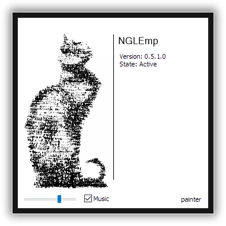

# NGLEmp

Best Photoshop 2021 and Photoshop CC 2019-2020 plugin.



---

## Content

- [Introduction](#introduction)
- [Features](#main-features)
- [Supported Products](#supported-products)
- [Versions History](#nglemp-versions-history)
- [Package Content](#package-content)
- [Install](#install)
- [Uninstall](#uninstall)
- [Known Issues](#known-issues)
- [FAQ](#faq)
- [Author](#author)
- [Verify checksums](#verify-checksums)
- [DOWNLOAD](#download)

---

## Introduction

- [NGLEmp Project Status](#nglemp-project-status)
- [Target Audience](#target-audience)

**NGLEmp** is an offline license enabler for Photoshop 2021 | 2020 | СС 2019 implemented as [Photoshop plugin][ps.plugin].


### NGLEmp Project Status

Status: **PROOF OF CONCEPT**

This means:

- Product may miss features
- Product may contain bugs
- Use at your own risk


### Target Audience

- [Licensed][genuine] users with long offline usage period
- [Privacy](#cloud-privacy)-concerned licensed users


---

## Main Features

- All product features are enabled with correct internal license structure
- No files patched on disk
- Original digital signatures are valid
- Quick and easy [restore](#uninstall) to original state
- Customisable features list
- Customisable profile details
- Smooth Photoshop updates

---

## Supported Platforms

- Windows only
- [x86-64](https://en.wikipedia.org/wiki/X86-64) only


## Supported Products

- Adobe Photoshop 2021 (`22.0` — `22.5`)
- Adobe Photoshop 2020 (`21.0`)
- Adobe Photoshop CC 2019 (`20.0`)


## Tested Photoshop versions

### Adobe Photoshop 2021

- 2021 `22.0.0` — `22.4.3`, `22.5.0`

### Adobe Photoshop 2020

- 2020 `21.0.0` — `21.2.11`

### Adobe Photoshop CC 2019

- CC 2019 `20.0.0` — `20.0.10`

---

## NGLEmp Versions History

### 0.8.0.0

`1 October 2021`

- [x] Support for offline Neural-filters:
	- Skin smoothing
	- JPEG Artifacts Removal
	- Style Transfer
	- Makeup Transfer
	- Super Zoom
	- Colorize
- [x] Updated internal structures

### 0.7.2.0

`25 August 2021`

- [x] Added `License` option to overide active license type to Tryout, for example.
- [x] Added `AutoSerial` option to hide you real serial number from the "About" dialog. Yes, we do care about your privacy.

### 0.7.1.0

`24 August 2021`

- [x] Support for Adobe Photoshop `2021` Summer release (22.5.x)
- [x] Patterns are updated for different versions to speedup initial launch
- [x] Stability improvements
- [x] Added `Forced` mode parameter to config

### 0.7.0.0

`29 December 2020`
- [x] Support for Adobe Photoshop `2021`
- [x] Display plugin and host versions
- [x] Patterns are updated for different versions to speedup initial launch
- [x] Host version autodetect. Version info removed from config
- [x] Stability and performance improvements
- [x] Tested all available public versions (2019, 2020, 2021)
- [ ] All cloud features (Neural Filters etc) still require account

### 0.6.9.0

`29 October 2019`
- [x] Support for Adobe Photoshop CC `2020`

### 0.5.1.0

`22 April 2019`
- [ ] Initial release
- [x] Support for Adobe Photoshop CC `2019`


---

## Cloud Privacy

Keep in mind that Adobe Cloud services collect and share your private data.

Check out official [Adobe Privacy Center][privacy].

---

## Package Content

Core components:

- `NGLEmp.8bx` - NGLEmp plugin, **required**
- `painter.cfg` - NGLEmp plugin configuration, **required**
- `NGLEmp.sha1` - [Checksums](#checksums) for release integrity check
- `README.md` - This [README][nglemp.readme] in Markdown (.md) format

Optional components:

- `com.adobe.ccx.start.7z` - Home Screen replacement from CC 2017, optional

---

## Install

- [Installation paths](#installation-paths)
- [Existing Licensed Installation](#existing-licensed-installation)
- [New Creative Cloud Installation](#new-creative-cloud-installation)
- [New Clean Installation](#new-clean-installation)
- [NGLEmp Installation](#nglemp-installation)
- [Verify installation](#verify-installation)
- [Home Screen](#home-screen)

### Installation paths

All relative paths are in Adobe Photoshop installation folder.

For example, default Photoshop 2021 installation path:

```
%ProgramFiles%\Adobe\Adobe Photoshop 2021\
```

Default **NGLEmp** installation path:

```
%ProgramFiles%\Adobe\Adobe Photoshop 2021\Required\Plug-ins\Extensions\
```

Note: You need to use real Adobe Photoshop 2021 | 2020 | CC 2019 installation path on your system.


### Existing Licensed Installation

If you already have licensed Adobe Photoshop installed, then you may write down your legal Adobe Photoshop Serial number to use it later.

1. Open Photoshop menu `Help -> System info...`
2. Find string `Serial number:` in the Photoshop system report.
3. Save your Serial number in `painter.cfg`:
	- `Serial` field in `Enigma` structure.
4. Install **NGLEmp**: see [NGLEmp Installation](#nglemp-installation).
5. Enjoy!


### New Creative Cloud Installation

Easy way to install and manage your Creative Cloud apps and services is [Creative Cloud Desktop Application][cc.desktop.app].

[Adobe ID][aid] is required for this type of installation!

1. Install [Creative Cloud Desktop Application][cc.desktop.app].
2. Install Adobe Photoshop 2021 | 2020 | CC 2019 using Creative Cloud Desktop Application.
3. Install **NGLEmp**: see [NGLEmp Installation](#nglemp-installation).
4. Enjoy!

Note: in this case you'll have bloated Creative Cloud desktop software installed.


### New Clean Installation

This type of installation doesn't require Adobe ID.

1. Install Adobe Photoshop 2021 | 2020 | CC 2019 using CCMaker (recommended at least version `1.3.15`) or by extracting installation files.
2. Install **NGLEmp**: see [NGLEmp Installation](#nglemp-installation).
3. Enjoy!

Tip: You may disable installation of bloated `CCX Process` via CCMaker to save some space.

Info: CCMaker doesn't install [Creative Cloud Desktop Application][cc.desktop.app], so you'll have even more space.

Attention: Don't install AMTEmu, it won't work!


### NGLEmp Installation

Always [verify integrity](#checksums) of NGLEmp release before installation!

1. NGLEmp Installation Path:
	- `.\Required\Plug-ins\Extensions\`
2. To install **NGLEmp** you need to copy just 2 files:
	- `NGLEmp.8bx`
	- `painter.cfg`

### Install batch sample (install.cmd)

```sh
@echo off
set PS_VERSION=2021
set dest=%ProgramFiles%\Adobe\Adobe Photoshop %PS_VERSION%\Required\Plug-ins\Extensions
copy /b NGLEmp.8bx "%dest%"
copy /b painter.cfg "%dest%"
```

Notes:
- Admin rights required.
- Change `PS_VERSION` to your Photoshop version.
	- `PS_VERSION=2021`
	- `PS_VERSION=2020` 
	- `PS_VERSION=CC 2019` 
- You need to use real Adobe Photoshop installation path on your system.

### Verify installation

- Menu `Help -> About Plug-ins -> NGLEmp...`
- You'll see plugin [version and state](#nglemp).
- Correct state is `Active`.

---

## Home Screen

- [Disable Home Screen](#disable-home-screen)
- [Replace Home Screen](#replace-home-screen)
	- [Home Screen from previous version](#home-screen-from-previous-version)
	- [Alternative Home Screen](#alternative-home-screen)

If you use Photoshop mainly offline, it's reasonable to replace Home Screen with offline version or disable it completely.


### Disable Home Screen

- Menu `Edit -> Preferences -> General (Ctrl+K)`
- In `Options` tab check `Disable the Home Screen`


### Replace Home Screen

Default Home Screen folder location:

- `Required\CEP\extensions`


#### Home Screen from previous version

1. Remove existing `com.adobe.ccx.start` folder in `.\Required\CEP\extensions`
2. Unpack [previous CC 2017 version archive][ccx.start] to `.\Required\CEP\extensions`

#### Alternative Home Screen

Search web for alternative Home Screen. There are some.

---

## Uninstall

- Remove `NGLEmp.8bx` and `painter.cfg` from `.\Required\Plug-ins\Extensions` folder.

### Uninstall batch sample (uninstall.cmd)

```sh
@echo off
set PS_VERSION=2021
set dest=%ProgramFiles%\Adobe\Adobe Photoshop %PS_VERSION%\Required\Plug-ins\Extensions
del /f "%dest%\NGLEmp.8bx"
del /f "%dest%\painter.cfg"
```

Notes:
- Admin rights required.
- Change `PS_VERSION` to your Photoshop version.
- You need to use real Adobe Photoshop installation path on your system.

---

## Known Issues

- [Canceled attempt to Sign-in](#canceled-attempt-to-sign-in)
- [Trial banner on top of Home Screen](#trial-banner-on-top-of-home-screen)
- [Cloud authorisation token could expire](#cloud-authorisation-token-could-expire)

### Canceled attempt to Sign-in

Photoshop will close if Sign-in dialog canceled.

Solution:

- Just don't cancel Sign-in dialog if you decided to sign-in to your Cloud account.
- Don't use Cloud and Sign-in dialog at all.


### Trial banner on top of Home Screen

Solutions:

- Option 1. [Disable Home Screen](#disable-home-screen) completely.
- Option 2. Use [alternative](#replace-home-screen) Home Screen from [previous version][ccx.start].


### Cloud authorisation token could expire

- In some cases you need to sign-in to your Cloud account again.

---

## Support

- No support at all. Just enjoy.
- If you feel a bit lonely with NGLEmp bugs, feel free to report [here][issue].

---

## FAQ

- [How to get rid of trial banner on top of Home Screen?](#how-to-get-rid-of-trial-banner-on-top-of-home-screen)
- [macOS support maybe?](#macos-support-maybe)
- [Could I modify painter.cfg?](#could-i-modify-paintercfg)
- [Should I use Cloud account?](#should-i-use-cloud-account)
- [How to donate?](#how-to-donate)

### How to get rid of trial banner on top of Home Screen?

See [Trial banner on top of Home Screen](#trial-banner-on-top-of-home-screen).


### macOS support maybe?

Maybe someday. (Actually not).


### Could I modify painter.cfg?

Yes, you can edit `painter.cfg`. It's as JSON-like (but not JSON) format UTF-8 text file.

Attention: Don't change names of structures!

Possible fields to edit in `painter.cfg`:

- `License` type, possible options:
	- Perpetual
	- Subscription
	- Tryout
	- Volume
- `AutoSerial` to hide your real serial number
- `Profile` structure, offline stub only:
	- Email
	- UserID
	- FirstName
	- LastName
	- CountryCode
- `Enigma` structure:
	- Serial
	- Version

### Should I use Cloud account?

No, it's optional. Always consider Cloud [privacy](#cloud-privacy).


### How to donate?

Donate to [GIMP][gimp] and [Krita][krita] community.

---

## Author

- **NGLEmp** crafted by painter

---

## DOWNLOAD

Always [verify integrity][integrity] of NGLEmp release!

### Checksums

It's very important to verify before install that **NGLEmp** release wasn't corrupted!

If **NGLEmp** checksums mismatch or your distribution doesn't have `NGLEmp.b3` and `NGLEmp.sha1` file, then release may be corrupted or infected with malware!

Get valid checksums [online at NGLEmp project page][integrity].

BLAKE3 and SHA-1 checksums of main files (stored in `NGLEmp.b3` and `NGLEmp.sha1`):

## NGLEmp 0.8.0.0

For Adobe Photoshop 2021, CC 2019-2020.

### BLAKE3

```
fbb0c5c02ca0e1e7ccc01ca38adaecf1fa9e2a6fad1ad7fe296b66c02400ce03  NGLEmp.8bx
8d53400efd802e0e1d54ba5cc0e8e8ed59da2c0f0499e2a5333abeee5b271868  painter.cfg
```

### SHA-1

```
a036199801a9c4a1f6523dea63bb6e114bbfe10d *NGLEmp.8bx
664a96376fee1a2a22fa2cc7252776ce40eda2b3 *painter.cfg
```

Note: Previous NGLEmp versions are listed in [VERSIONS](VERSIONS.md).

### Verify checksums

#### Verify BLAKE3 checksums

```sh
b3sum -c NGLEmp.b3
```

Correct answer:

```
NGLEmp.8bx: OK
painter.cfg: OK
```

#### Verify SHA-1 checksums

```sh
sha1sum -c NGLEmp.sha1
```

Correct answer:

```
NGLEmp.8bx: OK
painter.cfg: OK
```

**Never use NGLEmp release if checksums mismatch!**

### Download now!

- [NGLEmp][nglemp.release]. Password: VladimirMayakovsky
- [Home Screen alternative][ccx.start]

---

Enjoy!

[cc.desktop.app]: https://www.adobe.com/creativecloud/desktop-app.html
[nglemp.release]: https://mega.nz/file/sJsiFDaI#2vyCACLKhP2dV0rh3RHfepFmcE1esrH35L0lI4UeXQQ
[nglemp.release.0.7.2.0]: https://mega.nz/file/sJsiFDaI#2vyCACLKhP2dV0rh3RHfepFmcE1esrH35L0lI4UeXQQ
[nglemp.release.0.7.0.0]: https://mega.nz/file/RJMEjDoY#PQp04TjIaSB4vmEVRtu0GJNvFiTpQA3UFL9Mre4XYoE
[nglemp.release.0.6.9.0]: https://mega.nz/#!HMUl0AaR!FSXDQY_1Bd0Rs4XX5GYCybrmep_s2JfD7ZyHhtKu7_k
[nglemp.release.0.5.1.0]: https://links.snahp.it/hW12j6rLJC4R4GYUx1BKn1JAcpfaWEFZYNU
[nglemp.readme]: https://github.com/NGLEmp/NGLEmp/blob/master/README.md
[integrity]: https://github.com/NGLEmp/NGLEmp/blob/master/README.md#checksums
[ccx.start]: https://links.snahp.it/qcB679fxpTCaqv30DitWoHG1gnXmeB7g7BI
[issue]: https://github.com/NGLEmp/NGLEmp/issues
[ps.plugin]: https://en.wikipedia.org/wiki/Photoshop_plugin
[privacy]: https://www.adobe.com/privacy.html
[genuine]: https://www.adobe.com/genuine.html
[aid]: https://account.adobe.com
[gimp]: https://www.gimp.org/donating
[krita]: https://krita.org/en/support-us/donations
